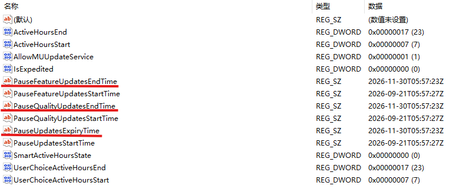

# Windows 11 26200.9457 延长更新期限方法

> 一种通过修改注册表中 Windows Update 更新暂停时间来延长更新期限的方法。

## 适用版本

-   Windows 11 **26200.9457**
-   注册表位置：`HKEY_LOCAL_MACHINE\SOFTWARE\Microsoft\WindowsUpdate\UX\Settings`

> **注意：** Windows Update 的行为可能会随着 Windows
> 版本、更新策略或微软后续调整而变化。本方法仅适用于Windows Update中**选择日历日期**的版本下的操作方式，不保证适用于所有
> Windows 11 版本。

------------------------------------------------------------------------

## 一、准备工作

修改注册表前，建议先备份相关注册表项。

### 备份方法

1.  按下 `Win + R`。

2.  输入：

    ``` text
    regedit
    ```

3.  按回车打开 **注册表编辑器**。

4.  定位到：

    ``` text
    HKEY_LOCAL_MACHINE\SOFTWARE\Microsoft\WindowsUpdate\UX\Settings
    ```

5.  可以右键 `Settings` 项，选择 **导出**，保存一份备份。

------------------------------------------------------------------------

## 二、找到需要修改的项目

进入：

``` text
HKEY_LOCAL_MACHINE\SOFTWARE\Microsoft\WindowsUpdate\UX\Settings
```

可以看到多个与 Windows Update 相关的值。

其中与更新暂停时间相关的 `EndTime` 项如下：

-   `PauseFeatureUpdatesEndTime`
-   `PauseQualityUpdatesEndTime`
-   `PauseUpdatesExpiryTime`

截图如下：



------------------------------------------------------------------------

## 三、修改 EndTime

### 1. 双击需要修改的 `EndTime`

例如：

``` text
PauseFeatureUpdatesEndTime
```

打开后可以看到类似：

``` text
2026-11-30T05:57:23Z
```

这里的时间采用类似 ISO 8601 的时间格式。

### 2. 修改结束时间

将 `EndTime` 的值修改为你希望的结束时间。

例如原来的：

``` text
2026-11-30T05:57:23Z
```

可以根据需要修改为更晚的日期。

需要注意：

-   建议保持原有的时间格式。
-   不要删除末尾的 `Z`。
-   修改前建议记录原始值，方便出现问题时恢复。
-   三个 `EndTime`
    分别对应不同的更新暂停项目，可以根据实际需求进行修改。

------------------------------------------------------------------------

## 四、三个 EndTime 的作用

  注册表值                       作用
  ------------------------------ -----------------------
  `PauseFeatureUpdatesEndTime`   功能更新暂停结束时间
  `PauseQualityUpdatesEndTime`   质量更新暂停结束时间
  `PauseUpdatesExpiryTime`       更新暂停期限/过期时间

因此，如果目的是延长 Windows Update 的暂停期限，需要重点关注这三个
`EndTime` 值。

------------------------------------------------------------------------

## 五、修改后的检查

修改完成后，可以重新打开：

``` text
设置 → Windows 更新
```

检查 Windows Update 中的暂停更新状态和到期时间是否发生变化。

如果界面没有立即刷新，可以：

1.  关闭 Windows 设置。
2.  等待一段时间后重新打开。
3.  必要时重新启动计算机。

------------------------------------------------------------------------

## 六、恢复方法

如果修改后出现异常，可以使用之前导出的注册表备份进行恢复。

也可以将修改过的值恢复为修改前记录的时间。

**不要随意删除整个 `Settings` 注册表项。**

------------------------------------------------------------------------

## 七、注意事项

1.  **修改注册表具有一定风险。**\
    不熟悉注册表的用户建议先备份。

2.  **本方法不是永久关闭 Windows Update。**\
    它主要是通过修改更新暂停相关的结束时间来延长暂停期限。

3.  **Windows Update 可能会重新写入这些值。**\
    如果系统或 Windows Update
    后续覆盖了注册表中的时间，可能需要重新检查。

4.  **不同 Windows 版本可能存在差异。**\
    本文记录的是 Windows 11 **26200.9457** 环境下的操作方法。

5.  **建议保留系统正常更新能力。**\
    长时间延迟系统更新可能导致无法及时获得安全更新，因此应根据实际需求合理设置更新暂停时间。

------------------------------------------------------------------------

## 免责声明

本文仅用于记录 Windows 系统设置和注册表操作方法。

修改注册表前请自行做好备份。由于 Windows Update
的实现可能随系统版本和微软策略变化，本文中的方法不保证在未来版本中继续有效。

------------------------------------------------------------------------

## 相关信息

**测试/记录版本：**

``` text
Windows 11 26200.9457
```

**注册表路径：**

``` text
HKEY_LOCAL_MACHINE\SOFTWARE\Microsoft\WindowsUpdate\UX\Settings
```

**主要修改项目：**

``` text
PauseFeatureUpdatesEndTime
PauseQualityUpdatesEndTime
PauseUpdatesExpiryTime
```
